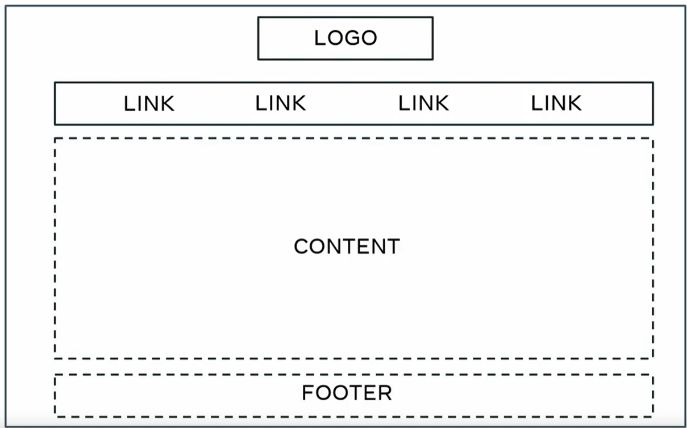
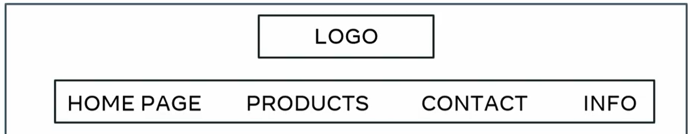
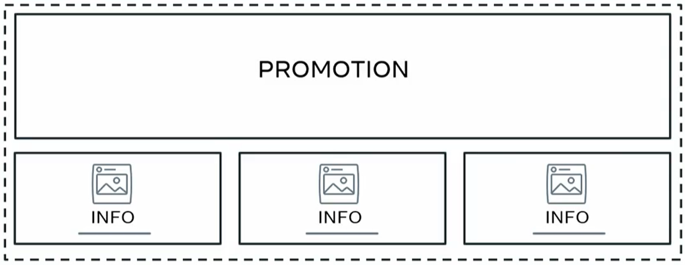
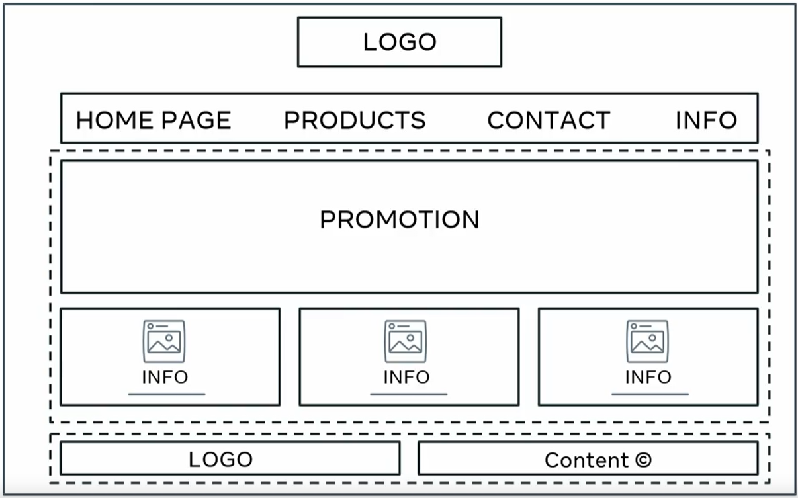
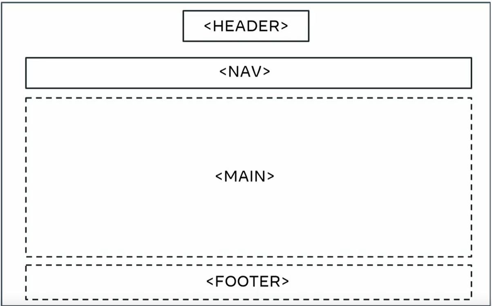
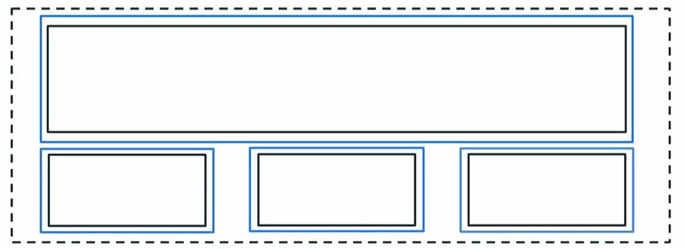
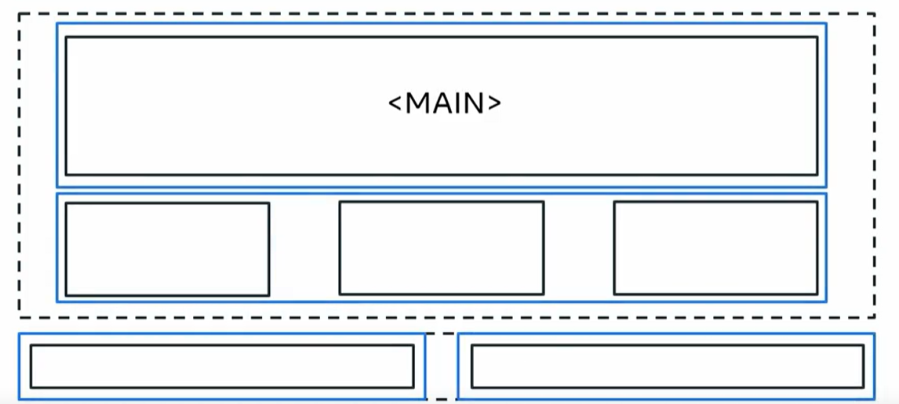

# Lucky-Shrub-Website

## Context and Requirements
The final project of the HTML and CSS in depth Coursera course part of the Meta Front-End Developer Certificate consists of making a website for a fictional business. Among all of the fictional businesses, we had to choose one and create a home page, an about page, a contact page and another page.

## Requirement

### Page Structure : 

- The main structure of the page consists of : 
    - header 
    - main content 
    - footer 
As illustrated in this figure : 

The header consist of : 
- The logo on top and centered and 
- The navigation bar with 4 links (example) : 
    - Home Page
    - Product 
    - Contact 
    - Info 

The main content consists of : 
- A big banner with the client's promotional offer 
- three columns and for each : 
    - An Image
    - A title 
    - And some text 

Footer consists of : 
- A small version of the logo on the left 
- Copyright content on the right

So overall, it should look like this withe details : 

### Semantics : 

- Use proper tags so that the page is accessible and Search Engine friendly.
- Header Tag for the Header Section 
- Nav Tag for the Navigation Section
- Main Tag for the Main Element
- Footer Tag for the Footer Element 

### Planning for the Layout of the page : 

- Grid or Flexbox Layout

#### Grid : 

#### Flexbox : 

- One full width colum and three box columns for the main content : 

- Main content is split into two row : 
    - The promotion one with one row and one column
    - The article ones with one row and three columns
- Footer is one row and two columns 

### Units of Measurement : 

- Em or Rem 